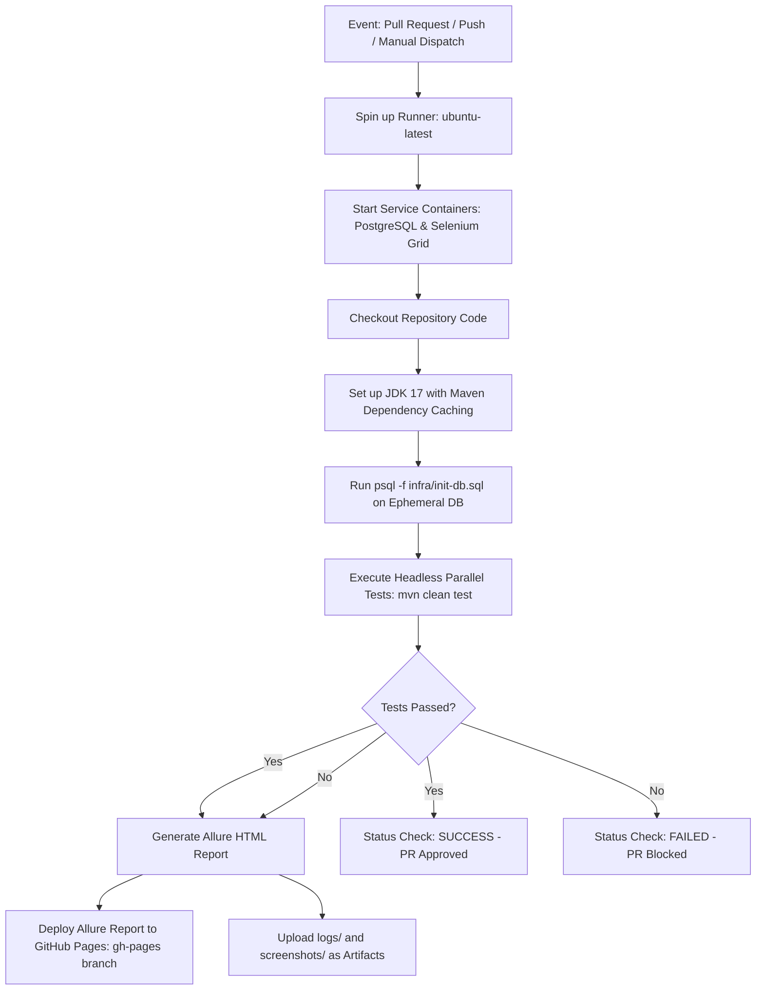

# CI/CD Pipeline & Quality Gates Module

**Tech Stack:** GitHub Actions, Maven, Docker Service Containers, Allure Report, GitHub Pages  
**Key Workflows:** `.github/workflows/ci-cd-pipeline.yml`

---

## 1. Purpose of the Module

In a high-performing engineering organization, automated tests provide no value if they only run locally on a QA engineer's laptop. Automated tests must act as **continuous quality gates** in the CI/CD pipeline, automatically verifying every pull request and release build before code is allowed to deploy to production.

The purpose of this module is to:
1. **Automate Continuous Verification:** Run regression suites on every GitHub Pull Request and merge to `main` / `develop`.
2. **Provision Ephemeral CI Testbeds:** Use GitHub Actions service containers to dynamically spin up isolated PostgreSQL and Selenium Grid instances for the pipeline run.
3. **Publish Interactive Executive Reports:** Automatically generate interactive **Allure Reports** with step-by-step logs and failure screenshots, published directly to **GitHub Pages**.
4. **Enforce Branch Protection Quality Gates:** Block pull requests from merging if any core payment or ledger regression test fails.

---

## 2. Workflow & Internal Lifecycle



---

## 3. Integration within the Framework

* **Integration with Maven Surefire:** Executes `src/test/resources/testng.xml` with system property overrides (`-Dheadless=true`, `-Dselenium.grid.url=http://localhost:4444`, `-Ddb.url=jdbc:postgresql://localhost:5432/fintech_db`).
* **Integration with Reporting:** Surefire outputs XML and Allure results into `target/allure-results`, which the pipeline aggregates into an interactive static dashboard.
* **Integration with Logging:** Compresses and archives `logs/framework.log` as downloadable GitHub Action build artifacts for debugging failed runs.

---

## 4. Senior SDET & QA Lead (6+ Years) Interview Q&A

### Q1: "How do you design a CI/CD test strategy to avoid slowing down developer pull requests?"
> **Answer:**  
> "Running a 45-minute full regression suite on every single pull request creates severe developer friction. We implement a **Tiered Testing Pyramid in CI/CD**:
> 1. **PR Smoke Gate (Fast Feedback, < 4 minutes):** Runs on every PR commit using TestNG groups (`@Test(groups = {"smoke", "p0"})`). It runs high-impact API contract tests and the Golden E2E scenario in headless parallel mode.
> 2. **Nightly Regression Suite (Deep Verification, ~30 minutes):** Runs on a cron schedule (`workflow_dispatch` / scheduled cron) against the full regression suite, testing all negative payment edge cases, full ledger audits, and UI permutations.
> 3. **Post-Deployment Smoke:** Runs immediately after deployment to QA or Staging environments to verify environment health."

### Q2: "How do you handle pipeline flakiness and prevent false alerts in CI/CD?"
> **Answer:**  
> "Pipeline flakiness destroys trust in automation. We combat it through three levels of defense:
> 1. **Automatic Test Retries:** We implement `RetryAnalyzer` and `IAnnotationTransformer` in TestNG, allowing transient network or socket blips to retry once without failing the build.
> 2. **Service Healthchecks:** In our pipeline YAML, service containers include explicit health checks (`--health-cmd pg_isready`) to ensure tests do not launch before the database is fully accepting connections.
> 3. **Flakiness Quarantine:** Any test that fails frequently during retries is automatically tagged as `@Test(groups = "quarantine")` and moved out of the mandatory PR blocking gate into an asynchronous monitoring job until stabilized."

### Q3: "How do you securely handle multiple deployment environments (DEV, QA, STAGING) in GitHub Actions?"
> **Answer:**  
> "We utilize **GitHub Environments** and parameterize the workflow with `workflow_dispatch`:
> ```yaml
> inputs:
>   environment:
>     description: 'Target Environment'
>     type: choice
>     options: [dev, qa, staging]
> ```
> In GitHub repository settings, we define environment-specific variables and secrets. When the workflow runs for `staging`, it automatically injects Staging API base URLs and database credentials, passing `-Denv=${{ github.event.inputs.environment }}` to our `FrameworkConfig` via Maven."

### Q4: "How do you ensure test artifacts (logs, screenshots, videos) are preserved when a CI test fails?"
> **Answer:**  
> "In GitHub Actions, subsequent steps normally stop executing if a previous step fails. We use the `if: always()` conditional:
> ```yaml
> - name: Upload Test Logs Artifacts
>   if: always()
>   uses: actions/upload-artifact@v4
>   with:
>     name: execution-logs
>     path: logs/
> ```
> Even when test assertions fail, the workflow guarantees that Log4j2 logs, surefire test reports, and failure screenshots are bundled into a downloadable zip file and attached to the GitHub Action run summary for post-mortem analysis."
