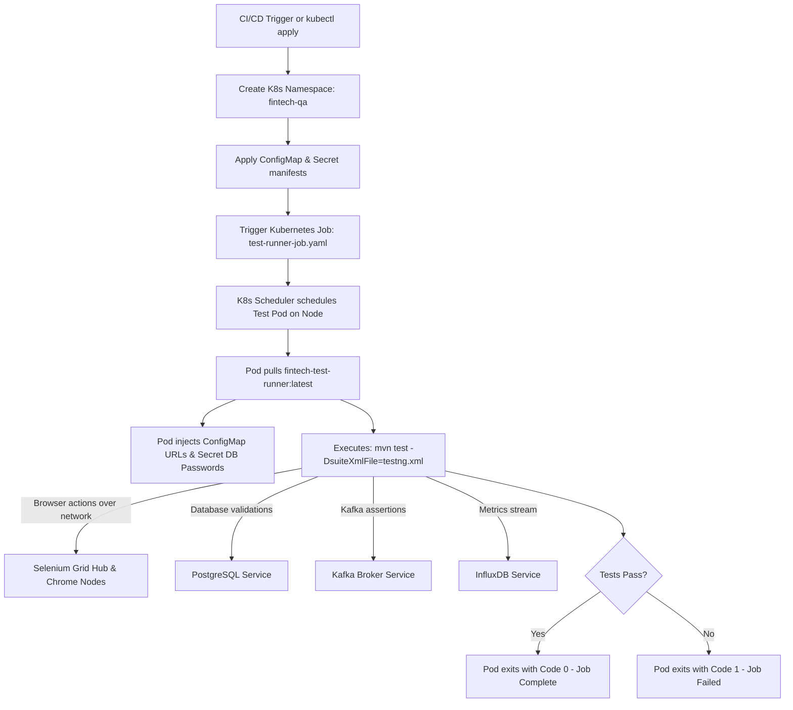

# Infrastructure, Docker & Kubernetes Module

**Tech Stack:** Docker 24+, Docker Compose, Kubernetes (K8s) v1.28+, Helm, Selenium Grid 4.19  
**Key Manifests:** `docker-compose.yml`, `Dockerfile`, `k8s/namespace.yaml`, `k8s/configmap.yaml`, `k8s/secret.yaml`, `k8s/test-runner-job.yaml`

---

## 1. Purpose of the Module

In modern enterprise testing, executing suites on a single local machine or a monolithic Jenkins agent causes resource bottlenecks, browser version mismatches, and severe environment drift.

The purpose of this module is to:
1. **Provide Ephemeral Testbeds:** Spin up complete, isolated environments containing PostgreSQL, Kafka, InfluxDB, Grafana, and WireMock in seconds via `docker-compose up -d`.
2. **Eliminate the "Works on My Machine" Problem:** Package the JDK runtime, Maven dependencies, test code, and configuration into a reproducible, immutable container image via a multi-stage `Dockerfile`.
3. **Enable Cloud-Native Distributed Execution:** Run automated test suites as **Kubernetes Jobs** in an isolated testing namespace (`fintech-qa`), pulling secrets and configurations dynamically from Kubernetes native objects.
4. **Scale Browser Capacity Dynamically:** Decouple the test execution engine from browser rendering by pointing tests to a containerized Selenium Grid where Chrome nodes scale elastically.

---

## 2. Workflow & Internal Lifecycle



---

## 3. Integration within the Framework

* **Integration with Configuration (`FrameworkConfig`):** In Kubernetes, `ConfigMap` values (`BASE_API_URL`, `SELENIUM_GRID_URL`, `DB_URL`) and `Secret` values (`DB_PASSWORD`, `INFLUXDB_TOKEN`) are injected as container environment variables and automatically picked up by the Owner library.
* **Integration with Driver Module (`DriverFactory`):** Connects to `http://selenium-hub.fintech-qa.svc.cluster.local:4444` for headless distributed execution.
* **Integration with Multi-Stage Dockerfile:** Builds a slim Alpine-based image that runs tests without requiring an entire local JDK installation.

---

## 4. Senior SDET & QA Lead (6+ Years) Interview Q&A

### Q1: "Why run test suites as a Kubernetes Job rather than a Kubernetes Deployment?"
> **Answer:**  
> "A **Kubernetes Deployment** is designed for long-running, continuous services (e.g. web servers or background workers). If a container in a Deployment exits, Kubernetes treats it as a failure and restarts it indefinitely.  
> An automated test suite, however, is a **finite task**: it starts, executes tests, generates reports, and must exit with a termination status code (`0` for success, non-zero for test failures). A **Kubernetes Job** (`kind: Job`) is purpose-built for batch workloads: it manages the pod lifecycle until completion, provides configurable retry policies (`backoffLimit: 0`), and cleanly preserves container logs for CI/CD inspection."

### Q2: "Why is `/dev/shm` (shared memory) configuration critical when running Chrome in Docker/Kubernetes?"
> **Answer:**  
> "By default, Docker and Kubernetes allocate only **64MB** of shared memory (`/dev/shm`) to containers. Modern browsers like Google Chrome heavily utilize shared memory for UI rendering and tab coordination. When running complex single-page apps or multiple browser tabs, Chrome quickly exhausts 64MB and crashes with `SessionNotCreatedException` or `Chrome failed to start: crashed`.  
> In our `docker-compose.yml` and Kubernetes pod manifests, we explicitly configure:
> ```yaml
> shm_size: 2gb
> ```
> (or mount an `emptyDir` volume with `medium: Memory` in Kubernetes at `/dev/shm`), guaranteeing Chrome has sufficient memory for stable parallel rendering."

### Q3: "How do you securely manage sensitive credentials (passwords, tokens) in Kubernetes test runs?"
> **Answer:**  
> "We never commit secrets, passwords, or tokens into code repositories, Dockerfiles, or properties files.  
> In Kubernetes, we separate configuration from credentials:
> 1. Non-sensitive URLs and ports reside in `k8s/configmap.yaml`.
> 2. Sensitive database passwords, private keys, and InfluxDB tokens are stored in `k8s/secret.yaml` as base64-encoded strings (or integrated with HashiCorp Vault / AWS Secrets Manager).
> 3. The test runner pod consumes them securely via `envFrom: secretRef`, keeping our test automation 100% compliant with SOC2 and PCI-DSS security standards."

### Q4: "How does this architecture achieve cost efficiency in cloud test execution?"
> **Answer:**  
> "Traditional static VM test grids sit idle outside of business hours, wasting thousands of dollars in cloud infrastructure.  
> Our containerized Kubernetes architecture achieves maximum cost efficiency through:
> 1. **Zero Idle Cost:** Test runner pods and ephemeral services only exist for the duration of the test job and are destroyed upon completion.
> 2. **Elastic Scaling (KEDA):** Browser nodes can be automatically scaled from 0 to 50 nodes based on queue depth in the Selenium Hub and scaled back to 0 when the suite finishes.
> 3. **Spot Instances:** Since test jobs are stateless, they run on inexpensive AWS Spot or GCP Preemptible VM instances, cutting cloud costs by up to 70%."
