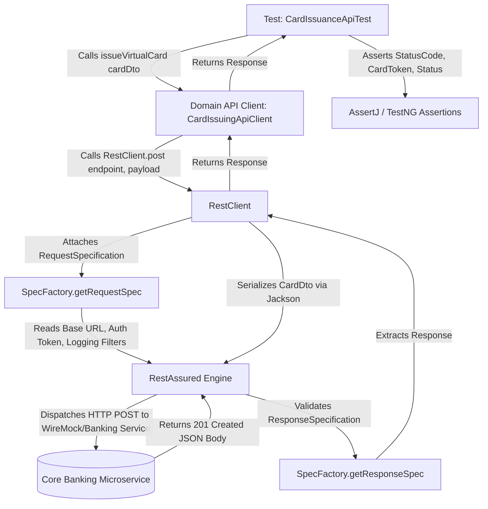

# API Automation Engine Module

**Tech Stack:** Java 17, RestAssured 5.4, Jackson Databind 2.17, AssertJ 3.25  
**Key Classes:** `SpecFactory.java`, `RestClient.java`, `CustomerApiClient.java`, `CardIssuingApiClient.java`, `AuthorizationApiClient.java`, Domain DTOs

---

## 1. Purpose of the Module

In a modern microservices-based core banking platform, REST APIs handle the heavy lifting: **Customer Onboarding & KYC, Card Issuance, Spending Limit Updates, and Point-of-Sale Payment Authorizations**.

The purpose of this module is to:
1. **Provide Fast-Feedback Testing:** Execute contract, functional, and schema validations at the service layer in milliseconds, rather than minutes.
2. **Accelerate End-to-End Test Setups:** In E2E tests, instead of spending 45 seconds filling out UI customer registration and card request forms, the API client provisions the customer and card via REST API in under 400ms, immediately leaving the UI test to verify only the customer-critical card activation step.
3. **Encapsulate HTTP Boilerplate:** Centralize headers, authentication tokens, base URIs, and logging filters into reusable specifications (`SpecFactory`), keeping test code clean and declarative.
4. **Strongly-Typed Domain Serialization:** Use POJO DTOs with the **Fluent Builder Pattern** and Jackson object mappers to dynamically generate financial payloads without messy hardcoded JSON string concatenation.

---

## 2. Workflow & Internal Lifecycle

---

## 3. Integration within the Framework

* **Integration with Configuration (`FrameworkConfig`):** Reads `base.api.url` (e.g. `http://localhost:8089` for WireMock or `https://qa.bank.com/api`) and dynamic OAuth2 Bearer tokens.
* **Integration with Mocking Engine (`EmbeddedMockBankingServer`):** When running locally or offline, all API requests are served by the embedded JDK HTTP server with zero network dependencies.
* **Integration with E2E Lifecycle Test:** Supplies the initial provisioned state (Customer ID, Account ID, Card Token) to the database and UI modules.

---

## 4. Senior SDET & QA Lead (6+ Years) Interview Q&A

### Q1: "Why do you use RequestSpecBuilder and ResponseSpecBuilder instead of defining specifications directly in each test method?"
> **Answer:**  
> "Directly configuring specifications within test methods violates the **DRY (Don't Repeat Yourself)** principle and leads to code duplication across hundreds of API tests. If the authentication header structure changes (e.g. migrating from `Authorization: Bearer <token>` to an API key or mTLS certificate), every single test would need modification.  
> In our framework, `SpecFactory` centralizes base URIs, default content types (`application/json`), acceptance headers, request logging, and authentication into a single immutable `RequestSpecification`. Any global infrastructure change is made in exactly one place."

### Q2: "Why do you use POJO DTOs with the Builder pattern over passing JSON files or string payloads?"
> **Answer:**  
> "Using raw JSON files or string templates has major architectural drawbacks:
> 1. **High Maintenance & Typo-Prone:** Hardcoded JSON strings do not provide compile-time safety or refactoring support in IDEs.
> 2. **Inflexible Test Data:** In fintech, payment payloads have dozens of conditional fields (CVV, MCC codes, currency, merchant category). Modifying specific fields dynamically in a static JSON file requires messy regex replacements or string manipulation.
> 
> By using **POJO DTOs with Fluent Builders** (e.g., `AuthorizationRequestDto.builder().amount(new BigDecimal("150.00")).currency("USD").build()`), our test data creation is strongly-typed, auto-completable in IDEs, easily serialized via Jackson, and allows setting only the fields relevant to each test scenario."

### Q3: "How do you test API Schema validation and prevent breaking changes from upstream microservices?"
> **Answer:**  
> "In addition to asserting functional response body fields (like `status: APPROVED`), we enforce **JSON Schema Validation** using RestAssured's `JsonSchemaValidator.matchesJsonSchemaInClasspath("schemas/payment_auth_schema.json")`.  
> This acts as an automated contract test. If an upstream payments engineering team renames a field (e.g., `authCode` to `authorization_code`) or changes a numeric field to a string, our schema validation immediately catches the contract violation during the pull request pipeline before code reaches production."

### Q4: "How do you handle OAuth2 token expiration and token caching across parallel test threads?"
> **Answer:**  
> "Generating a new OAuth2 token before every single API call adds huge latency (often 200–500ms per request) and can trigger rate-limiting on corporate identity providers (Okta, Keycloak).  
> In an enterprise framework, we implement a thread-safe **Token Manager** with atomic synchronization (`AtomicReference<Token>` or double-checked locking). The Token Manager fetches a token once, records its expiry timestamp (`expires_in`), and caches it in memory. Subsequent API calls reuse the cached token. A refresh is triggered automatically only when the current time is within 30 seconds of token expiry, ensuring zero authentication failures during multi-hour test runs."
