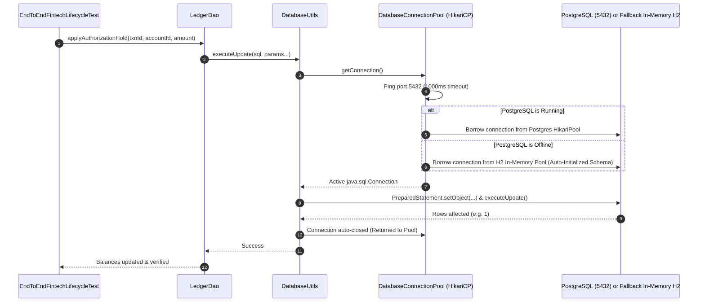

# Database Ledger & DAO Validation Module

**Tech Stack:** Java 17, HikariCP 5.1, PostgreSQL JDBC Driver, H2 Database 2.2, DAO Pattern  
**Key Classes:** `DatabaseConnectionPool.java`, `DatabaseUtils.java`, `CardDao.java`, `LedgerDao.java`, `infra/init-db.sql`

---

## 1. Purpose of the Module

In the fintech and banking domain, UI and API status codes (`200 OK`) are **never sufficient** to certify that a financial transaction is valid. A payment gateway might return `200 Approved`, but if the core ledger fails to update account balances, deduct available credit, or log the double-entry accounting records, catastrophic financial discrepancy occurs.

The purpose of this module is to:
1. **Validate Core Ledger Accounting:** Perform direct SQL assertions on account balances, hold amounts, and double-entry ledger entries (`double_entry_ledger`).
2. **Prevent Connection Pool Exhaustion:** When dozens of parallel test threads execute database queries simultaneously, opening raw `DriverManager.getConnection()` calls exhausts database connections and crashes the test suite. This module uses **HikariCP**, the industry's fastest production connection pool, to reuse and throttle connections.
3. **Decouple Database Schema via DAO Pattern:** Encapsulate all SQL queries inside domain Data Access Objects (`CardDao`, `LedgerDao`). If the database schema changes, tests remain untouched; only the DAO is updated.
4. **Guarantee Zero-Dependency Portability:** Features an automatic in-memory **H2 PostgreSQL-mode fallback** that self-seeds the database schema if a developer runs tests without a local PostgreSQL instance.

---

## 2. Workflow & Internal Lifecycle



---

## 3. Integration within the Framework

* **Integration with Configuration (`FrameworkConfig`):** Reads JDBC URLs (`jdbc:postgresql://localhost:5432/fintech_db`), credentials, and maximum pool size (`db.pool.max.size = 10`).
* **Integration with Docker (`docker-compose.yml`):** Connects to the local PostgreSQL container initialized with `infra/init-db.sql`.
* **Integration with E2E Lifecycle Test:** Validates that after an authorization API call, the card status transitioned to `ACTIVE` and the available balance was correctly debited in the database.

---

## 4. Senior SDET & QA Lead (6+ Years) Interview Q&A

### Q1: "Why did you implement HikariCP connection pooling instead of opening a direct JDBC connection in each test?"
> **Answer:**  
> "Establishing a new TCP socket connection and performing TLS handshakes and authentication with a relational database (PostgreSQL/Oracle) takes between **50ms to 200ms per connection**. In a parallel test suite executing 50 tests concurrently, opening and tearing down raw connections would:
> 1. Drastically slow down the overall suite runtime.
> 2. Rapidly hit the database's `max_connections` limit (e.g. 100), throwing `FATAL: too many connections for role`.
> 
> HikariCP solves this by maintaining a warm, pre-allocated pool of reusable connections (e.g. 10 connections). When a DAO query runs, it borrows an active connection in sub-milliseconds, executes the query, and returns it to the pool in a `try-with-resources` block, keeping test execution fast and resource-efficient."

### Q2: "How do you protect database automation queries from SQL Injection vulnerabilities and syntax errors?"
> **Answer:**  
> "We strictly prohibit string concatenation in SQL queries (`SELECT * FROM cards WHERE id = '" + cardId + "'`). Instead, `DatabaseUtils.java` enforces **Parameterized PreparedStatements**:
> ```java
> String sql = "SELECT status FROM cards WHERE id = ?";
> try (PreparedStatement stmt = conn.prepareStatement(sql)) {
>     stmt.setObject(1, cardId);
>     ...
> }
> ```
> This prevents SQL injection attacks, safely handles special characters, dates, and null values, and allows the database engine to cache the compiled query execution plan."

### Q3: "How do you maintain test data isolation and prevent parallel tests from corrupting each other's database records?"
> **Answer:**  
> "In an enterprise banking automation framework, parallel tests cannot share or overwrite the same customer or account balance. We enforce a **Unique Data Partitioning Strategy**:
> 1. Every test generates unique UUID-based identifiers for entities (`CRD-" + UUID.randomUUID()`, `TXN-" + UUID.randomUUID()`).
> 2. Tests operate only on their own partitioned records.
> 3. For account balances, each parallel test provisions or targets its own isolated account row, ensuring that concurrent debits or credits do not create race conditions or assertion failures."

### Q4: "What is double-entry bookkeeping, and how do you automate ledger validations in fintech?"
> **Answer:**  
> "In fintech and banking, money is never simply added or removed from a single column; every financial movement requires a **Double-Entry Ledger** entry where every Debit has an equal and corresponding Credit ($Debit = Credit$).  
> In our framework's `LedgerDao.java`, when an authorization hold occurs:
> 1. We verify that the customer's `available_balance` decreases by the transaction amount while `hold_balance` increases by the exact same amount.
> 2. We verify that a row is inserted into the `double_entry_ledger` table with `entry_type = 'DEBIT'`, recording the `transaction_id`, the exact timestamp, and the calculated `balance_after`.
> 3. We assert that the sum of all posted debits and credits across the ledger equals zero."
