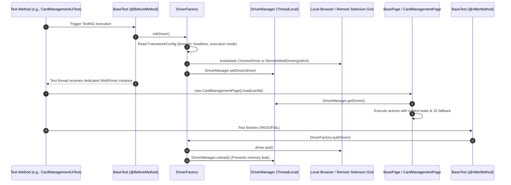

# Driver & UI Automation Module

**Tech Stack:** Java 17, Selenium WebDriver 4.19, TestNG 7.9, ThreadLocal, Fluent POM  
**Key Classes:** `DriverManager.java`, `DriverFactory.java`, `OptionsManager.java`, `BasePage.java`, `CardManagementPage.java`

---

## 1. Purpose of the Module

In an enterprise fintech automation framework, UI automation handles critical customer-facing workflows such as **Card Activation, PIN Setup, Security Freezing, and Payment Checkout**. 

The purpose of this module is to:
1. **Guarantee 100% Thread Safety:** Ensure that when tests run in parallel across multiple threads (`parallel="methods"` in TestNG), each test thread operates in a completely isolated browser session without session leakage or race conditions.
2. **Abstract Browser Complexity:** Support local browser execution (Chrome, Firefox, Edge) and containerized cloud/grid execution (Selenium Grid Hub, Docker nodes) via clean configuration switches (`-Dexecution.mode=grid`).
3. **Eliminate Flakiness:** Provide resilient explicit wait abstractions (`WebDriverWait`) and JavaScript fallback mechanisms within `BasePage` to handle asynchronous DOM updates and animations.
4. **Implement Fluent Page Object Model (POM):** Enable intuitive, self-documenting method chaining (e.g., `cardPage.clickActivateCard().setPin(pin)`).

---

## 2. Workflow & Internal Lifecycle



---

## 3. Integration within the Framework

* **Integration with Configuration (`FrameworkConfig`):** Reads browser type (`chrome`, `firefox`, `edge`), headless flag (`true`/`false`), and grid URL dynamically.
* **Integration with Reporting & Observability (`GrafanaTestListener`):** When a UI test fails, the listener invokes `DriverManager.getDriver()` to capture a screenshot as a byte array and automatically attaches it to the Allure report.
* **Integration with Domain E2E Scenarios:** In `EndToEndFintechLifecycleTest`, the UI module activates the card after it is issued via REST API, bridging API state to browser DOM.

---

## 4. Senior SDET & QA Lead (6+ Years) Interview Q&A

### Q1: "Why did you use `ThreadLocal<WebDriver>` instead of a standard Singleton or static WebDriver?"
> **Answer:**  
> "A static `WebDriver` instance is a shared mutable resource across the JVM. If we execute tests in parallel using TestNG's `parallel="methods"` or `parallel="tests"`, multiple threads will attempt to navigate, click, and evaluate locators on the exact same browser window, resulting in immediate race conditions, `StaleElementReferenceException`, and crashes.  
> In our framework, `DriverManager` wraps `WebDriver` inside a `ThreadLocal<WebDriver>`. Every Java worker thread spawned by TestNG has its own isolated memory copy of the WebDriver reference. Calling `DriverManager.getDriver()` resolves strictly to the current thread's browser instance, achieving 100% thread isolation during parallel runs."

### Q2: "Why is `DriverManager.unload()` (`ThreadLocal.remove()`) mandatory in the teardown?"
> **Answer:**  
> "In high-scale enterprise CI/CD environments where thread pools (like `ForkJoinPool` or TestNG worker threads) are reused across test suites, failing to invoke `ThreadLocal.remove()` causes a **Classloader Memory Leak**. The thread object retains a strong reference to the `WebDriver` instance and its underlying native memory even after `driver.quit()` is called. Calling `DriverManager.unload()` explicitly clears the thread-local map entry, allowing the garbage collector to reclaim browser-associated resources."

### Q3: "How do you handle `ElementClickInterceptedException` when overlays or animation banners appear in modern single-page apps?"
> **Answer:**  
> "In `BasePage.java`, our `click(By locator)` method uses a two-tier strategy. First, it waits for `ExpectedConditions.elementToBeClickable(locator)` and attempts a standard W3C Selenium click. If an `ElementClickInterceptedException` is thrown (commonly caused by loading overlays, sticky navbars, or CSS transitions), we catch the exception and immediately invoke a JavaScript fallback:
> ```java
> ((JavascriptExecutor) driver).executeScript("arguments[0].click();", element);
> ```
> This bypasses the DOM layer obstruction and directly dispatches the click event in the browser engine without compromising test reliability."

### Q4: "How does your UI framework scale from a local developer laptop to a cloud Kubernetes cluster?"
> **Answer:**  
> "Through the **Factory Pattern** in `DriverFactory.java`. When running locally, the framework sets `executionMode = local` and instantiates a local browser binary via Selenium Manager.  
> When running in CI/CD or Kubernetes, the pipeline injects `-Dexecution.mode=grid` and `-Dselenium.grid.url=http://selenium-hub:4444`. The `DriverFactory` creates a `RemoteWebDriver` configured with container-optimized capabilities (`--no-sandbox`, `--disable-dev-shm-usage`, `--headless=new`). The test runner pod consumes minimal memory, while the actual browser rendering is distributed across elastic Kubernetes Chrome nodes."
