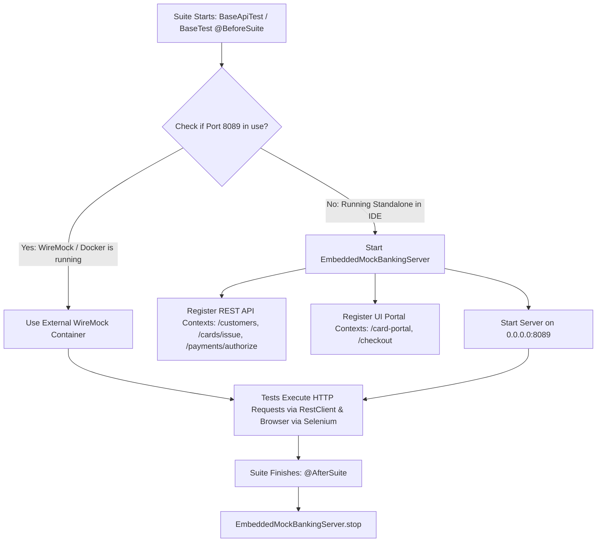

# Service Virtualization & Mocking Module

**Tech Stack:** Java 17, JDK HttpServer (`com.sun.net.httpserver`), WireMock 3.5  
**Key Classes:** `EmbeddedMockBankingServer.java`, `infra/wiremock/mappings/`

---

## 1. Purpose of the Module

In enterprise fintech environments, test automation cannot rely directly on live card payment networks (Visa/Mastercard, core banking ledger APIs, or third-party credit check vendors). Third-party sandboxes frequently experience downtime, impose strict API rate-limits, and charge per API transaction.

The purpose of this module is to:
1. **Provide Service Virtualization:** Emulate core banking REST endpoints (`/customers`, `/cards/issue`, `/payments/authorize`) and web portals with deterministic, high-speed contract responses.
2. **Guarantee Zero-Dependency Developer Experience:** Allow any SDET, QA engineer, or CI runner to clone the repository and run `mvn clean test` **immediately** without having Docker or external network connectivity.
3. **Simulate Complex Payment Edge Cases:** Easily simulate bank declines (HTTP 402 / Response Code `51` Insufficient Funds), fraud blocks (Response Code `05` Do Not Honor), and network timeouts.
4. **Eliminate Environment Drift:** Serve identical contract responses whether running locally inside Eclipse or inside a Kubernetes cluster via WireMock containers.

---

## 2. Workflow & Internal Lifecycle

---

## 3. Integration within the Framework

* **Integration with API Module (`RestClient`):** RestClient routes calls to `http://localhost:8089`, which is transparently handled by either WireMock or the embedded server.
* **Integration with UI Module (`CardManagementPage`):** Navigates to `http://localhost:8089/card-portal` to interact with an interactive HTML DOM simulating cardholder self-service portals.
* **Integration with Docker (`docker-compose.yml`):** Maps `infra/wiremock/mappings/` into a WireMock container for containerized test runs.

---

## 4. Senior SDET & QA Lead (6+ Years) Interview Q&A

### Q1: "What is the difference between Service Virtualization, Mocking, and Stubbing in an enterprise testing strategy?"
> **Answer:**  
> - **Stubbing:** Providing hardcoded return values for specific method calls within the same process memory (e.g. `Mockito.when(service.call()).thenReturn(...)`).
> - **Mocking:** Verifying that a specific interaction occurred (e.g. asserting that a service was invoked exactly once with specific arguments).
> - **Service Virtualization:** Emulating the behavior of an entire external system over real network protocols (HTTP/REST, gRPC, Kafka, MQ). It runs over a live network socket (port 8089), responds to real HTTP requests, simulates latency, handles headers and status codes, and allows the framework to test client libraries end-to-end without touching the real backend."

### Q2: "Why did you implement both a WireMock container AND an in-process Embedded JDK HTTP Server?"
> **Answer:**  
> "This represents a **progressive resilience strategy**:
> 1. **In CI/CD & Kubernetes:** WireMock containers running in Docker Compose or K8s namespaces provide centralized, team-wide mock stubs loaded from JSON files (`infra/wiremock/mappings/`).
> 2. **On Developer/QA Laptops:** If an SDET or developer opens Eclipse on a laptop without Docker installed or with limited RAM, running tests would normally crash with `Connection Refused`. Our `EmbeddedMockBankingServer` uses Java's built-in JDK `HttpServer` (zero external dependencies) to automatically spin up and serve the exact same API contracts in under 15 milliseconds, guaranteeing a frictionless developer experience."

### Q3: "How do you test negative payment authorization scenarios (e.g., Card Expired, Insufficient Funds, Fraud Declines)?"
> **Answer:**  
> "In payment systems, ISO 8583 response codes dictate transaction outcomes. Using service virtualization, we configure scenarios by passing custom request headers or amount thresholds:
> - Normal amount ($\le \$1000$): Returns HTTP `200 Approved` with Response Code `00`.
> - Over-limit amount ($> \$5000$): Returns HTTP `402 Declined` with Response Code `51` (Insufficient Funds).
> - Suspicious MCC / Country: Returns HTTP `403 Blocked` with Response Code `05` (Fraud Block).  
> This allows us to test the entire client retry, error logging, and user notification flows without having to artificially manipulate real bank accounts."

### Q4: "How do you ensure that your mock responses stay synchronized with production API changes?"
> **Answer:**  
> "We prevent 'mock drift' through two mechanisms:
> 1. **OpenAPI / Swagger Contract Validation:** We validate both our mock definitions and our API test assertions against the official OpenAPI specification using schema validators.
> 2. **Bi-Directional Contract Testing (Pact):** If the core banking team changes a field in their API schema, consumer-driven contract tests fail in their pull request pipeline before the breaking change is deployed, ensuring our virtualized services always mirror production reality."
