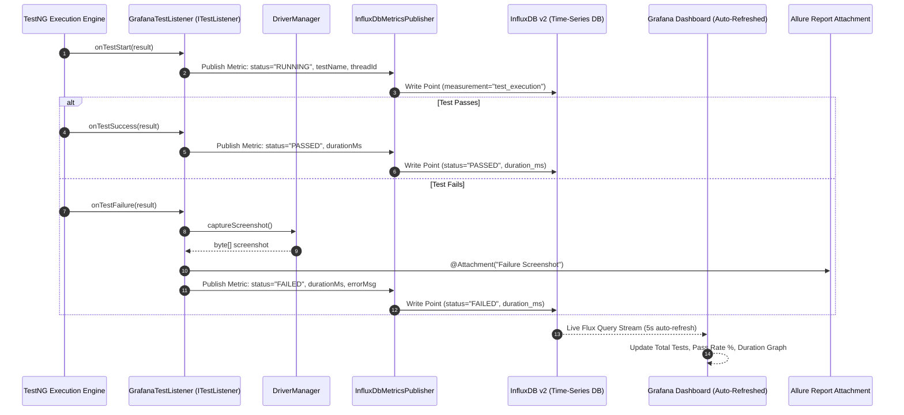

# Observability & Real-Time Monitoring Module (Grafana + InfluxDB)

**Tech Stack:** Java 17, InfluxDB Client Java 6.12, Grafana 10.4, TestNG ITestListener, Allure TestNG 2.26  
**Key Classes:** `GrafanaTestListener.java`, `InfluxDbMetricsPublisher.java`, `infra/grafana/provisioning/`

---

## 1. Purpose of the Module

In large-scale enterprise test automation suites running hundreds of tests across distributed Kubernetes pods, **static post-run HTML reports (Allure, ExtentReports) are insufficient**. Waiting 30 to 45 minutes for a CI test run to complete before discovering that a regression occurred is an unacceptable delay for fast continuous delivery teams.

The purpose of this module is to:
1. **Provide Real-Time Execution Observability:** Stream test lifecycle events (`STARTED`, `PASSED`, `FAILED`, `SKIPPED`, duration in ms) to **InfluxDB** the exact millisecond they happen.
2. **Enable Live Executive Dashboards in Grafana:** Allow QA Leads, SDETs, and Engineering Managers to watch test velocity, active threads, pass/fail ratios, and execution progress live in Grafana (`http://localhost:3000`).
3. **Detect Latency Spikes & Performance Degradation:** Track test execution duration trends across builds to catch subtle performance regressions in API or UI workflows before they hit production.
4. **Automate Failure Evidence Capture:** Intercept test failures in `GrafanaTestListener`, extract screenshots from `DriverManager`, and attach them directly to Allure reports.

---

## 2. Workflow & Internal Lifecycle



---

## 3. Integration within the Framework

* **Integration with `testng.xml`:** Registered as a global listener `<listener class-name="com.fintech.framework.observability.GrafanaTestListener"/>`.
* **Integration with Docker (`docker-compose.yml`):** Connects to InfluxDB v2 (port `8086`) and Grafana (port `3000`) with auto-provisioned dashboards loaded from `infra/grafana/`.
* **Integration with UI Driver:** Intercepts `WebDriver` from `DriverManager` upon failure to capture PNG screenshots without cluttering test code.

---

## 4. Senior SDET & QA Lead (6+ Years) Interview Q&A

### Q1: "Why build real-time Grafana observability into an automation framework when tools like Allure and ExtentReports already exist?"
> **Answer:**  
> "Allure and ExtentReports are **post-mortem, static artifacts**. They are generated only after the entire Maven build finishes.  
> In enterprise environments running 2,000+ tests across parallel cloud pods:
> 1. If a database migration broke the entire authentication subsystem at minute 2 of a 40-minute run, Allure won't tell you until minute 40. With Grafana, the QA Lead sees the failure rate spike to 100% within 10 seconds and can immediately abort the run, saving CI compute costs.
> 2. Allure doesn't provide historical time-series analytics. In Grafana, we can run queries comparing test duration across the last 50 builds to detect microservice latency degradation."

### Q2: "How do you structure time-series data in InfluxDB (Tags vs Fields) for test telemetry?"
> **Answer:**  
> "In InfluxDB, **Tags are indexed strings** used for filtering and grouping, while **Fields are unindexed values** used for mathematical aggregation:
> - **Tags (Indexed):** `test_name`, `class`, `status` (`PASSED`, `FAILED`), `environment` (`qa`, `staging`), `browser`, `thread_id`.
> - **Fields (Aggregatable):** `duration_ms` (integer/float), `retry_count`.
> 
> This schema allows us to write high-performance Flux queries in Grafana like:
> ```flux
> from(bucket: "test-metrics")
>   |> range(start: -1h)
>   |> filter(fn: (r) => r["status"] == "FAILED")
>   |> group(columns: ["class"])
>   |> count()
> ```
> instantly visualizing the top failing test classes across the suite."

### Q3: "Does streaming metrics over HTTP to InfluxDB impact test execution speed?"
> **Answer:**  
> "No, for two reasons:
> 1. `InfluxDbMetricsPublisher` uses connection pooling and lightweight point serialization that sends minimal UDP/HTTP bytes.
> 2. Metric publishing occurs inside TestNG listener hooks (`onTestSuccess`, `onTestFailure`) after the test logic has already completed, adding zero latency to the actual test assertions.  
> Furthermore, if InfluxDB is unreachable (e.g. running offline), the publisher gracefully catches the connection exception and bypasses telemetry without failing the test suite."

### Q4: "How do you track and isolate flaky tests over time using this observability architecture?"
> **Answer:**  
> "By combining `RetryAnalyzer` with `GrafanaTestListener`:
> 1. When a test fails on attempt 1 and passes on attempt 2, the listener tags the metric with `status='RETRY_PASS'`.
> 2. In Grafana, we built a dedicated **Flakiness Heatmap** panel tracking tests where `RETRY_PASS > 0`.
> 3. This gives QA Leads objective data during sprint retrospectives showing which tests have timing issues or network flakiness, allowing us to quarantine and stabilize them without blocking CI/CD pipelines."
